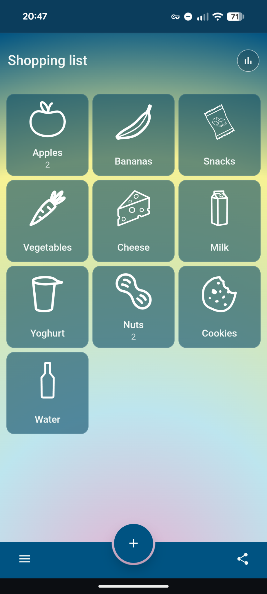
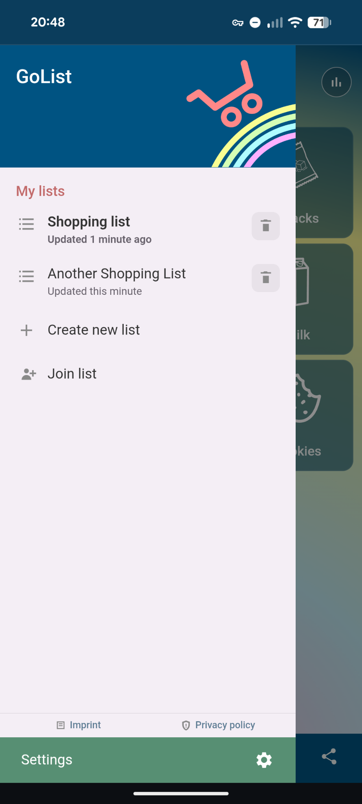
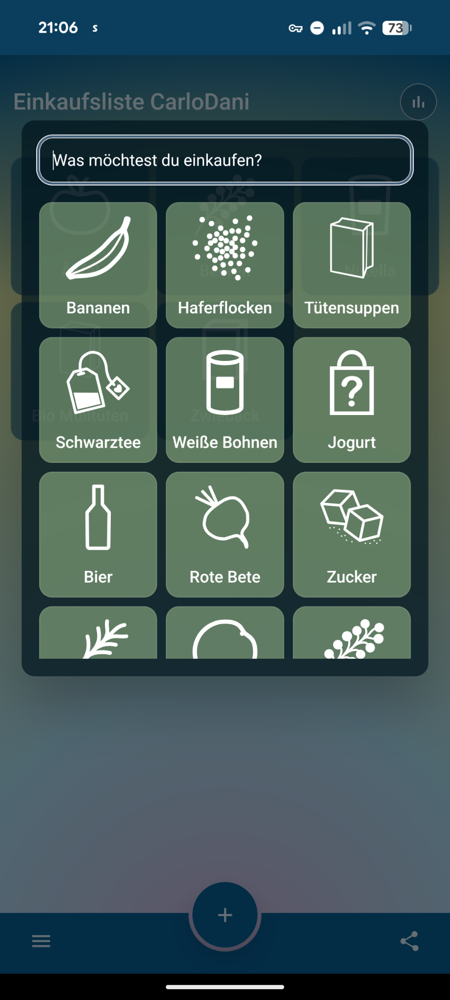

# 🛒 GoList

[GoList](https://golist2.vercel.app/) is a grocery-list PWA with optional backend sharing and real-time sync. The web app in [`apps/web`](./apps/web) is offline-first, storing list data locally in IndexedDB. The backend in [`apps/backend`](./apps/backend) provides list APIs, token-based sharing, and WebSocket sync.

## ✨ Features

- simplistic icons for many items
- real time sync with friends
- no user accounts needed
- offline first (everything except the sync works offline)

## 📱 Screenshots

|                                                   |                                                   |                                                   |
| ------------------------------------------------- | ------------------------------------------------- | ------------------------------------------------- |
|  |  |  |

## 🚀 Built with

[React](https://react.dev/), [TypeScript](https://www.typescriptlang.org/), [Vite](https://vite.dev/), [Dexie](https://dexie.org/), [Zustand](https://zustand-demo.pmnd.rs/), [Fastify](https://fastify.dev/), [Zod](https://zod.dev/), [pg](https://node-postgres.com/), and [vite-plugin-pwa](https://github.com/vite-pwa/vite-plugin-pwa).

## 🗂️ Project structure

```text
.
├── AGENTS.md
├── apps
│   ├── api-spec
│   ├── backend
│   │   ├── api
│   │   └── src
│   │       ├── config
│   │       ├── db
│   │       │   └── migrations
│   │       ├── plugins
│   │       ├── repositories
│   │       ├── routes
│   │       └── test
│   ├── openclaw
│   └── web
│       ├── public
│       │   └── icons
│       └── src
│           ├── components
│           ├── domain
│           ├── hooks
│           ├── i18n
│           ├── sharing
│           ├── state
│           └── storage
├── docs
├── package.json
├── packages
│   └── shared
│       └── src
│           └── domain
└── tsconfig.base.json
```

- [`apps/web/public/icons`](./apps/web/public/icons): grocery/item icon assets for the PWA UI.
- [`apps/web/src/sharing`](./apps/web/src/sharing): backend API client and WebSocket sync client.
- [`apps/backend/src/routes`](./apps/backend/src/routes): HTTP and WebSocket endpoints.
- [`apps/backend/src/db/migrations`](./apps/backend/src/db/migrations): SQL schema migrations.
- [`packages/shared/src/domain`](./packages/shared/src/domain): shared domain types, mappings, and sync helpers.

## 🏃 Running locally

Install dependencies once from the repo root:

```bash
npm install
```

### Frontend (web app)

```bash
npm run dev:web        # dev server at http://localhost:5173
npm run build:web      # production build → apps/web/dist/
npm run preview:web    # serve the production build locally
```

The web app is fully usable offline without a backend – sharing and real-time sync simply won't be available.

### Backend (optional)

The backend requires a PostgreSQL database. The easiest way to get one running locally is via the bundled Docker Compose config:

```bash
cd apps/backend
docker compose up -d postgres   # start Postgres in the background
cd ../..
npm run dev:backend              # dev server at http://localhost:3000
```

Apply migrations before the first run (or after adding new ones):

```bash
npm run db:migrate -w apps/backend
```

Optionally seed the database with sample data:

```bash
npm run db:seed -w apps/backend
```

#### Environment variables

| Variable     | Default       | Description                                           |
| ------------ | ------------- | ----------------------------------------------------- |
| `HOST`       | `0.0.0.0`     | Address the server binds to                           |
| `PORT`       | `3000`        | HTTP port                                             |
| `NODE_ENV`   | `development` | `development` / `production` / `test`                 |
| `PGHOST`     | `localhost`   | Postgres host                                         |
| `PGUSER`     | `golist`      | Postgres user                                         |
| `PGDATABASE` | `golist`      | Postgres database name                                |
| `PGPASSWORD` | `golist`      | Postgres password                                     |
| `PGSSLMODE`  | `require`     | Postgres SSL mode (`disable`, `prefer`, `require`, …) |

`NEON_PG*` variants (e.g. `NEON_PGHOST`) can be used as fallbacks for the corresponding `PG*` variables, which is convenient when deploying to [Neon](https://neon.tech/).

## 🐳 Running with Docker Compose

A Docker Compose file at [`apps/backend/docker-compose.yml`](./apps/backend/docker-compose.yml) starts both Postgres and the backend server together:

```bash
cd apps/backend
docker compose up --build
```

This exposes the backend on `http://localhost:3000` and Postgres on port `5432`.

## 📄 License

GoList is licensed under the [GNU General Public License v3.0](./LICENSE).
You are free to use, modify, and distribute this software under the terms of the GPL-3.0.
